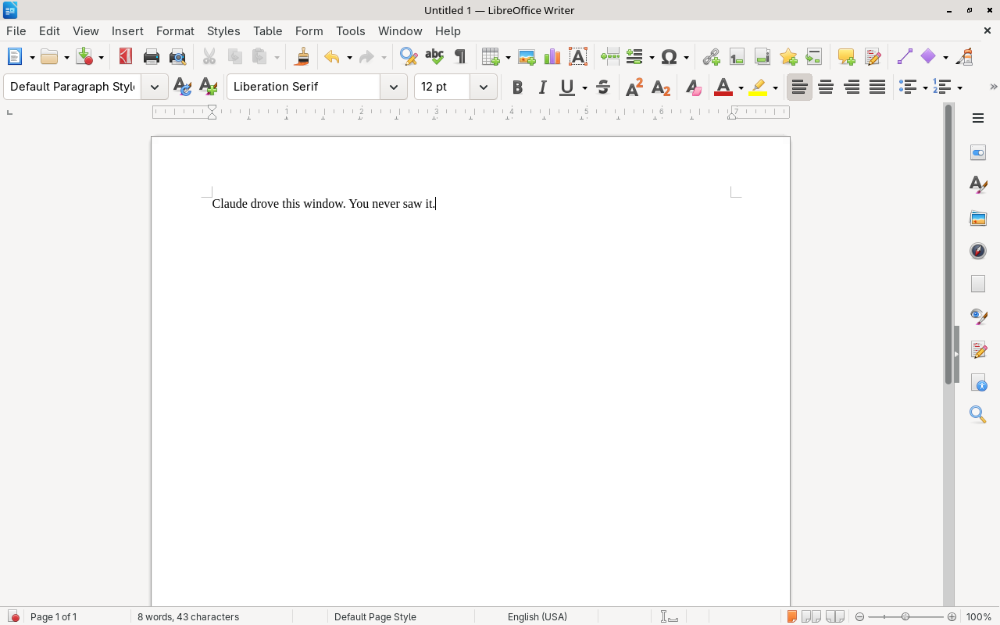

# wbox-mcp

**Run any desktop app in an isolated box that Claude can see and control — without touching your desktop.**

Most computer-use servers automate *your* screen: they move your real mouse, steal your focus, and see whatever you have open. wbox gives the app its own nested compositor instead. Claude clicks and types inside that box, screenshots it pixel-perfect, and your desktop never knows it happened. You can keep working while it does.



*LibreOffice Writer, launched and typed into by Claude through wbox — captured with `headless: true`, so this window never rendered on anyone's desktop.*

## Why not just use a desktop-takeover server?

| | wbox | Typical computer-use / desktop MCP |
|---|---|---|
| **Isolated from your desktop** | Yes — nested compositor, own seat | No — shares your screen and input |
| **Runs in the background** | Yes — keep working while it drives | No — it owns your mouse and focus |
| **Offscreen / headless** | Yes — `headless: true`, nothing renders | Rarely |
| **Can the app see your screen?** | No | Yes — everything you have open |
| **Can it read your clipboard?** | Only if you let it (`clipboard_bridge`) | Yes |
| **Safe for CI** | Yes | No |

That combination is the whole point. If you only need to automate the machine you're staring at, a simpler server will do.

## Install

```bash
# Linux
curl -sSL https://raw.githubusercontent.com/quazardous/wbox-mcp/main/setup.sh | bash

# Windows
irm https://raw.githubusercontent.com/quazardous/wbox-mcp/main/setup.ps1 | iex
```

On Windows, read [docs/windows.md](docs/windows.md) first — there is no isolation there. The installer sets up Python too if the machine has none.

**What that script does**, so you can decide before running it: it installs the missing system packages through your distro's package manager (`dnf`, `apt` or `pacman`, asking first), clones this repo into `~/.local/share/wbox-mcp`, installs it into a venv there, and symlinks the two commands `wboxr` and `wbox-mcp` into `~/.local/bin`. It touches nothing else and needs `sudo` only for the packages.

**Manual install**, if you'd rather not pipe a script into a shell:

```bash
# 1. System packages — required
sudo apt install labwc grim xdotool x11-xkb-utils wlr-randr wlrctl
#    ...and optional, for extra compositors and input backends
sudo apt install weston cage xclip wl-clipboard wtype

# 2. wbox itself
git clone https://github.com/quazardous/wbox-mcp.git ~/.local/share/wbox-mcp
cd ~/.local/share/wbox-mcp
python3 -m venv .venv && .venv/bin/pip install -e .
ln -s ~/.local/share/wbox-mcp/.venv/bin/{wboxr,wbox-mcp} ~/.local/bin/
```

Package names differ per distro — `setxkbmap` is `x11-xkb-utils` on Debian/Ubuntu, `setxkbmap` on Fedora, `xorg-setxkbmap` on Arch. The setup script knows the mapping for all three.

## Quick start

```bash
cd my-project/
wboxr init --register
```

That creates `wbox/config.yaml` and registers the server in `.mcp.json`. The wizard adapts to your platform.

```bash
# Non-interactive
wboxr init --name writer --app-command "soffice --writer" --register
```

## End to end

`wboxr init --register` writes this into your `.mcp.json`:

```json
{
  "mcpServers": {
    "writer": {
      "type": "stdio",
      "command": "/home/you/.local/bin/wbox-mcp",
      "args": ["serve", "--mcp-dir", "/home/you/my-project/wbox"]
    }
  }
}
```

And `wbox/config.yaml` looks like this — the whole minimal form:

```yaml
name: writer
compositor: labwc          # labwc | weston | cage | win32
screen: "1280x800"
input_backend: hybrid      # hybrid | x11 | wayland
headless: false            # true = runs offscreen, nothing on your desktop
keyboard_layout: us        # pin this on a non-US host, or typing comes out wrong
app:
  command: soffice --writer
```

Then just ask:

> Open Writer, type "Hello World", and show me a screenshot.

Claude calls `launch`, `type_text` and `screenshot` on its own. The window never appears on your desktop if `headless: true`, and never steals your focus either way.

Two settings are worth knowing before you automate a real app:

- **`keyboard_layout`** — input injection assumes US keycode positions. On an AZERTY host without this, `type_text("abc123")` can arrive as `qbc!@#`.
- **`post_launch_keys`** — shortcuts sent once the app has rendered, e.g. `["super+a"]` to maximize it. Slow apps like LibreOffice usually want this plus a longer `timeouts.app_render`.

## Platform features

| Feature | Linux | Windows |
|---------|-------|---------|
| Screenshot | grim (pixel-perfect) | PrintWindow — works behind other windows |
| Keyboard | wbox-keyboard (virtual keyboard) | SendInput (Unicode) / PostMessage |
| Mouse | wbox-pointer (virtual pointer) | SendInput / PostMessage |
| Clipboard | xclip + bridge to host | Win32 clipboard API — yours, shared |
| Window management | wlrctl (list/focus) | Currently broken — returns nothing |
| Resize display | wlr-randr | Resizes the window, a few pixels off |
| App isolation | Full (nested compositor) | **None** (normal process) |
| Background operation | Yes (isolated display) | Screenshots only; most input takes focus |
| Offscreen / headless | Yes (`headless: true`) | No — `headless` is ignored |
| Interferes with host | No | Yes — most clicks move your cursor and take focus |

**Linux** — the app runs inside a nested Wayland compositor (labwc, weston or cage). Full isolation: the app cannot see or interfere with your desktop. Clipboard is bridged automatically, and you can switch that bridge off. Keyboard and mouse are injected through Wayland virtual-input protocols, so nothing leaks onto your own seat.

Set `headless: true` and the nested session runs offscreen — no window on your desktop, while screenshots, clicks and keystrokes keep working exactly the same. Handy for test suites and unattended runs.

**Windows** — the app runs as a normal process, driven through Win32 APIs. There is no isolation: the app shares your desktop and your clipboard, and most clicks warp your real mouse cursor and pull the window to the front. Screenshots work even when the window is covered.

Two things are safer than they used to be. `type_text` types the characters and never touches your clipboard. And when the app window can't be brought to the front, `click`, `mouse_move` and key combos refuse and name the window that is in the way, instead of clicking it. Elevated apps remain largely off-limits. [docs/windows.md](docs/windows.md) has what was measured to work, the limitations, and troubleshooting.

## MCP tools

`launch` · `stop` · `kill` · `screenshot` · `click` · `type_text` · `key` · `keys` · `mouse_move` · `get_mouse_position` · `get_size` · `resize` · `list_windows` · `focus_window` · `clipboard_read` · `clipboard_write` · `tail_log` · `clean` · `debug_input`

Plus custom script tools via `wboxr tool add`.

### When something goes wrong

- **`stop`** — graceful shutdown: SIGTERM, then SIGKILL after `timeouts.stop`.
- **`kill`** — force-kills every compositor and app process and clears the recorded state. This is the one to reach for if a session died mid-launch and left a stale socket behind; the next `launch` also cleans stale sockets on its own.
- **`clean`** — housekeeping only: removes logs and screenshots. It does not kill anything.
- **`tail_log`** — read the app's log without leaving the conversation.

## Documentation

- [docs/usage.md](docs/usage.md) — CLI flags, config.yaml reference, MCP tools details, requirements
- [docs/backends.md](docs/backends.md) — compositor comparison, input backends
- [docs/matrix.md](docs/matrix.md) — what's verified to work on Linux, per compositor and backend
- [docs/windows.md](docs/windows.md) — the Windows backend: install, input routing, measured status, limitations, troubleshooting

## License

MIT
